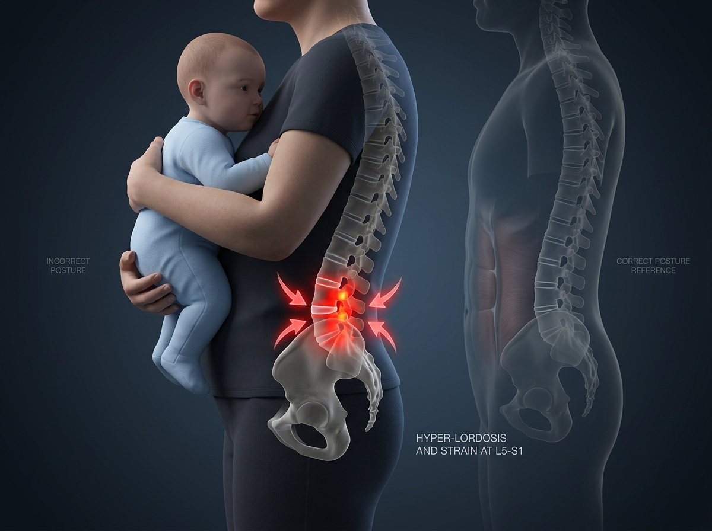
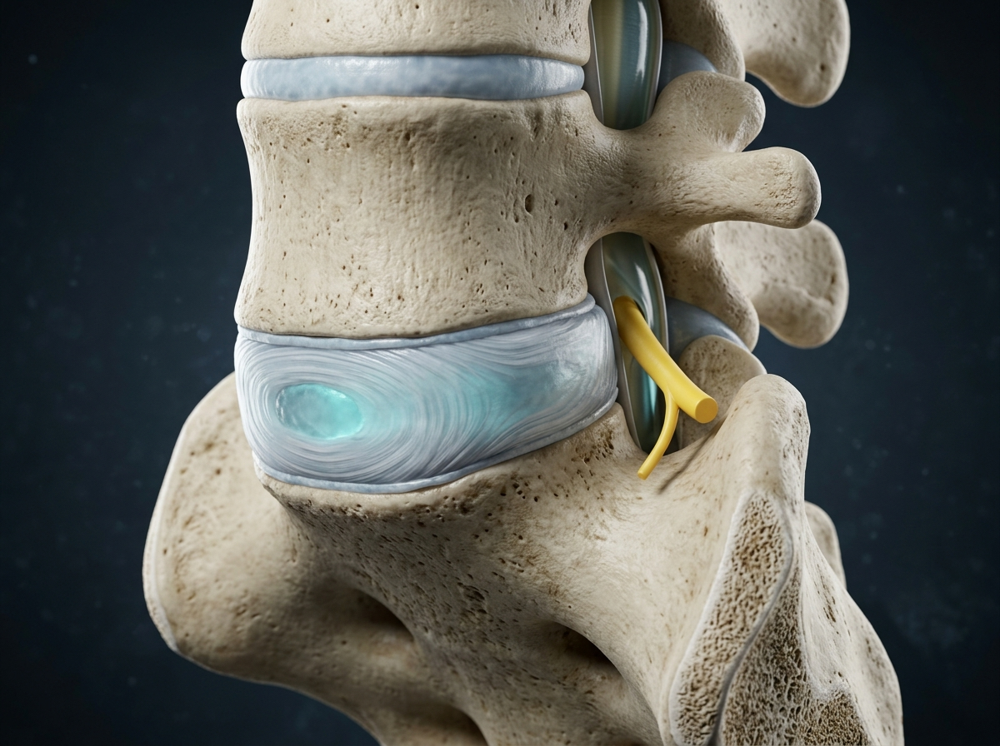
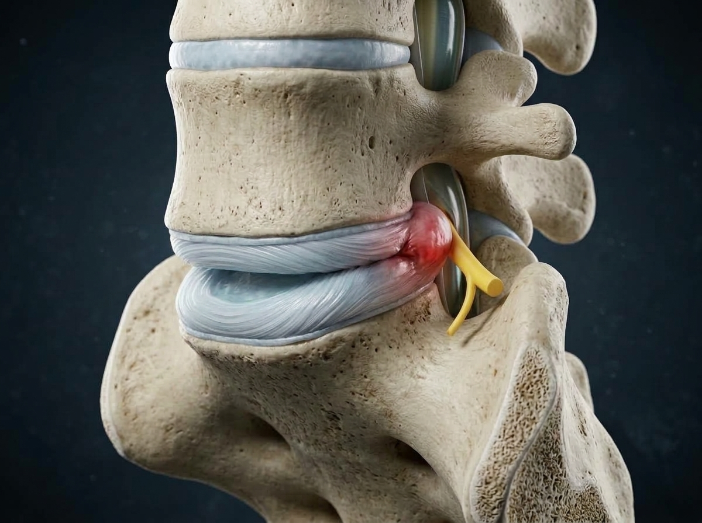
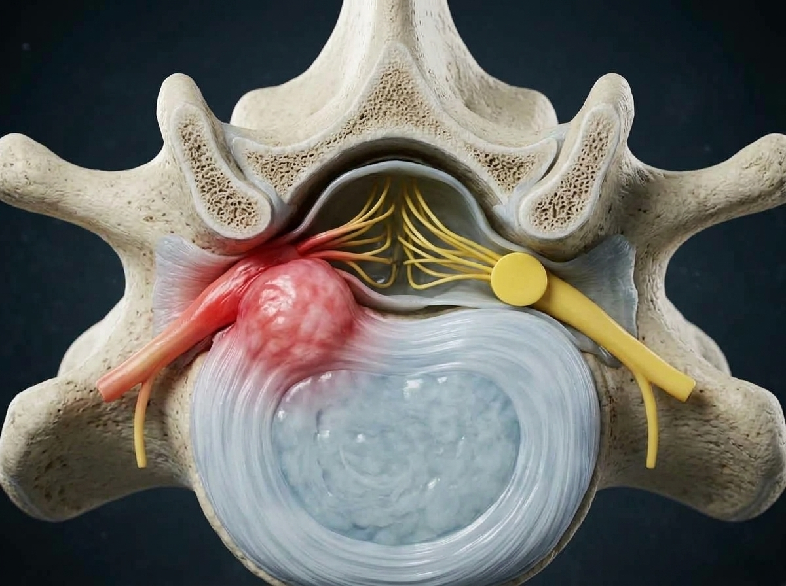
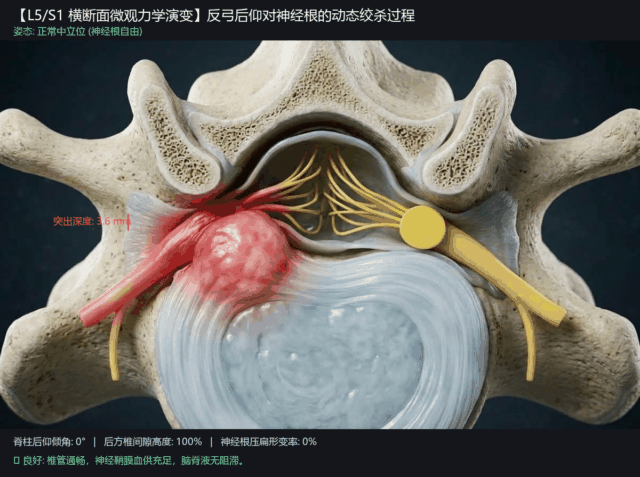

# 🛡️ ProtectingLumbarSpine - 个人腰椎数字化健康档案与生物力学分析库

> **说明**：本仓库为个人腰椎（L5/S1）健康状态跟踪、高精度 CT 影像 3D 重建量化、带娃抱娃力学致痛机理分析及长期复查对比的**完全独立开源健康工程**，与任何业务代码完全解耦。

---

## 📑 核心专题文档导航

1. 🔬 **[01. CT 影像亚毫米薄层量化分析与诊断报告](./docs/01_CT影像量化分析与诊断报告.md)**
   * 全腰椎 0.625mm 螺旋 CT 容积切片 MPR 重建、矢状位全景与轴位高倍率测量、天生宽马蹄椎管优势解析。
2. ⚡ **[02. 抱娃反弓腰力学分析与 10 阶段神经绞杀演进](./docs/02_抱娃反弓力学与10阶段演进.md)**
   * 8kg 婴儿前倾力矩、骨盆代偿前移、为什么护腰防弯腰但防不住后仰、前后夹板绞杀效应及动态视频解析。
3. 💊 **[03. 科学防护用药、抱娃姿势纠正与护腰避坑指南](./docs/03_科学防护用药与护腰避坑指南.md)**
   * 急性期与维持期一线用药方案（塞来昔布/乙哌立松/甲钴胺/氟比洛芬）、诺泰 F06 3代滑轮款佩戴规范、闲鱼避坑与带娃工具升级。
4. 🛠️ **[04. 未来复查对比与自动化脚本使用说明](./docs/04_复查对比与自动化脚本使用说明.md)**
   * 自动化 Python DICOM 重建流水线使用说明、新旧影像 1:1 解剖基线对比指南。

---

## 📊 2026-04-06 影像学基线量化看板

| 核心指标 | 基线实测值 | 临床定级与解剖状态 | 长期管理预期 |
| :--- | :---: | :--- | :--- |
| **病变节段** | **L5/S1** | 最底端承重椎间盘，单节段受累 | 严格保护 L4/L5，防止邻近节段继发代偿退变 |
| **突出形态与方向** | **局限型，中央偏右** | 侵占右侧侧隐窝前缘，右侧为主要受累区 | 日常症状多放射至右侧臀部/右大腿后侧/足底 |
| **突入椎管深度** | **5.6 mm** | **中度突出**（已突破纤维环产生机械占位） | 目标：保守治疗促使局部炎症吸收并稳定瘢痕化 |
| **硬脊膜囊剩余有效径** | **14.8 mm** | 前后径压缩约 26%，前壁弧形凹陷 | 仍保留良好脑脊液环流通畅度 |
| **骨性椎管形态** | **宽大马蹄形** | **先天性结构优势**：椎管储备充足，无骨性狭窄 | 90% 以上可通过正规非手术保守治疗恢复 |

---

## 🖼️ 精选高保真 3D 医学仿真解剖图谱

### 1. 抱娃反弓全身力学透视（为什么痛得直不起腰？）


---

### 2. 矢状位：中立平衡（左） vs 抱娃反弓骨质咬合夹击（右）
| 健康中立位（0°，椎管通畅） | 抱娃极限反弓后仰（骨质如剪刀咬合） |
| :---: | :---: |
|  |  |

---

### 3. 横断面俯视：右侧 S1 神经根受“前后夹板绞杀”


---

## 🎬 横断面反弓受压动态医学仿真视频

> 离线原画视频路径：[`./media/video/axial_extension_dynamic.mp4`](./media/video/axial_extension_dynamic.mp4)



* **动态力学演变**：完整展示了当腰椎由中立位进入反弓后仰（0° ➔ 26°）时，后方椎间隙由 100% 塌陷至 40%，突出物突入深度激增至 5.9mm，将右侧 S1 神经根活生生压扁（形变率 74%），导致微循环闭塞缺血、爆发神经高频电风暴的全过程。

---

## ⚠️ 绝对红旗警报（必须立刻就医的手术指征）

保守治疗期间，若出现以下任一症状，提示受压迫神经出现急性缺血坏死或马尾综合征，**必须在 24~48 小时内前往三甲医院脊柱外科急诊，不可拖延**：
1. **足下垂 / 严重肌力减退**：右脚单脚无法踮起脚尖行走，走路抬不起脚拖地；
2. **马尾神经损害**：肛周、会阴部（鞍区）出现像打了麻药一样的麻木感；
3. **括约肌功能障碍**：排尿无力、尿潴留、尿不尽或大便失控。

---

## 🛠️ 项目目录结构

```text
ProtectingLumbarSpine/
├── README.md               # 项目主页与核心健康看板 (当前文件)
├── .gitignore              # 规范 Git 忽略配置 (拦截大体积原始 DICOM)
├── docs/                   # 4 篇详尽的专题医学与力学文档
│   ├── 01_CT影像量化分析与诊断报告.md
│   ├── 02_抱娃反弓力学与10阶段演进.md
│   ├── 03_科学防护用药与护腰避坑指南.md
│   └── 04_复查对比与自动化脚本使用说明.md
├── media/                  # 高清多媒体资产库
│   ├── images/             # 矢状位/轴位实测切片与高保真 3D 医学图谱 (9张)
│   ├── diagrams_10steps/   # 10 阶段连续力学生物模型图 (12张)
│   └── video/              # 30 FPS 高清原画 MP4 视频与无缝循环动图
└── scripts/                # 自动化 DICOM 处理与 3D MPR 重构流水线
    ├── dicom_pipeline.py   # 核心处理脚本 (供日后复查一键生成报告)
    └── requirements.txt    # Python 科学计算依赖清单
```