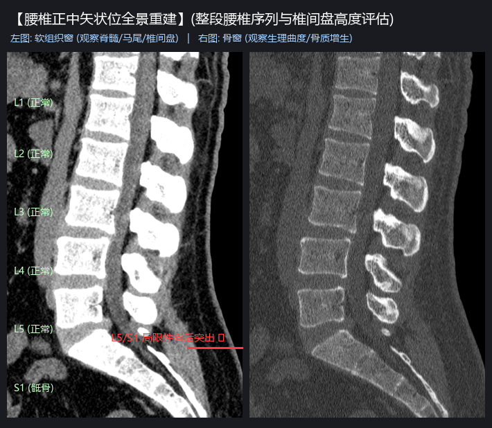
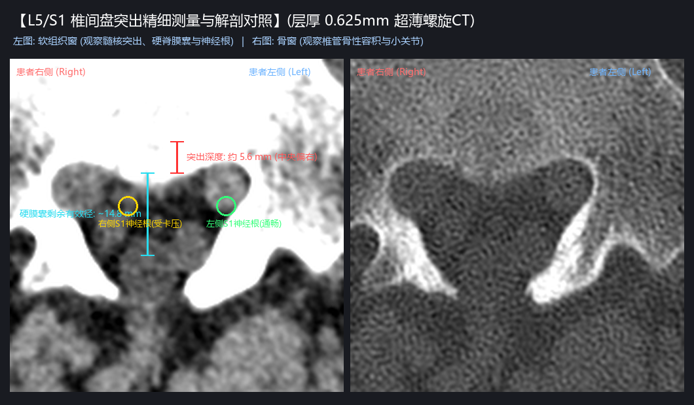
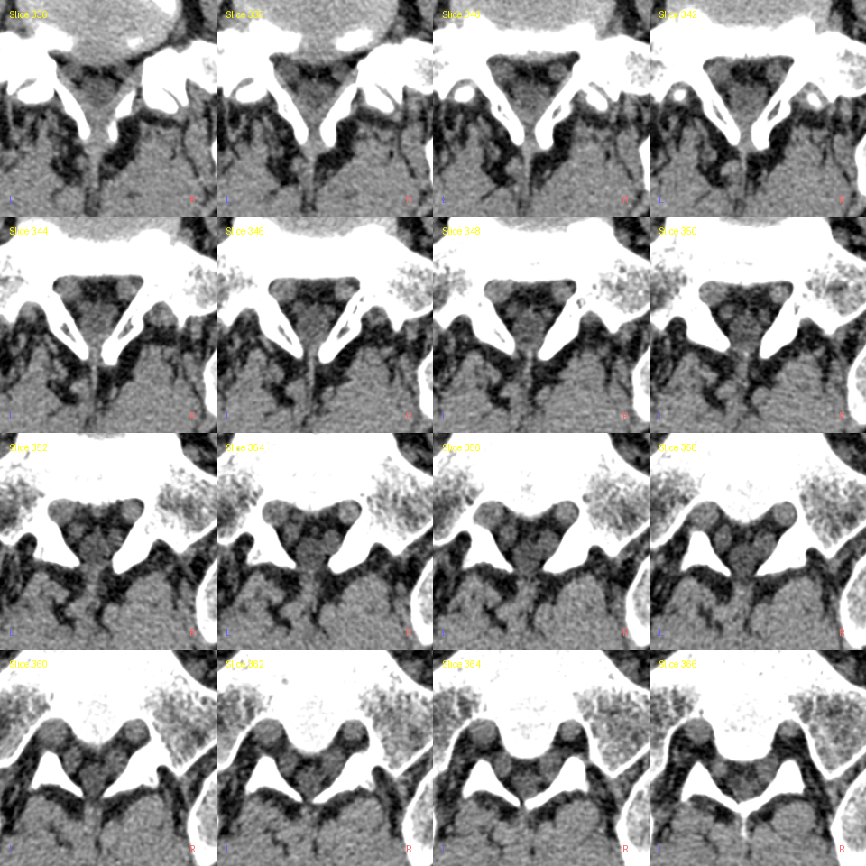
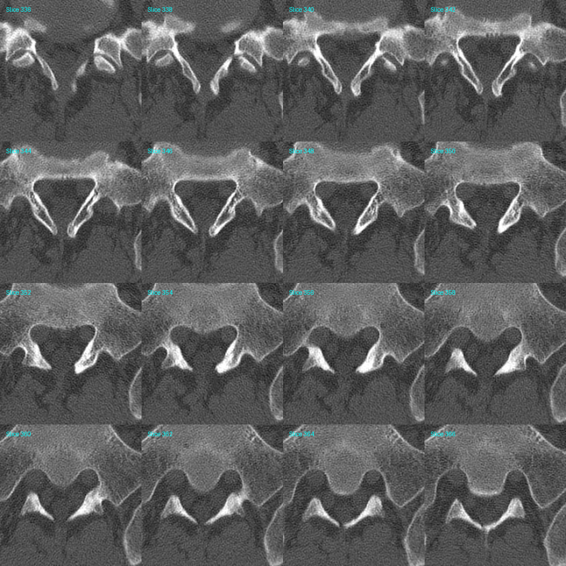

# L5/S1 腰椎 CT 亚毫米薄层量化分析与临床影像诊断报告

> **检查基准**：2026年4月6日 门诊薄层螺旋 CT 平扫（0.625mm 超薄容积扫描，共 1011 个 DICOM 原始切片）  
> **受检部位**：全腰椎（T12~S2），重点聚焦 **L5/S1** 承重椎间盘

---

## 一、 影像学精细测量数据总览

通过对 448 层 0.625mm 软组织窗序列（Series #5）与骨窗序列（Series #4）进行三维多平面重建（MPR），获得微米级解剖量化指标：

| 测量项目 | 实测数值 | 正常参考值 | 临床与力学意义 |
| :--- | :---: | :---: | :--- |
| **突出节段** | **L5/S1** | - | 处于脊柱底端最大负重节段 |
| **突出形态与方向** | **局限型，正中偏右** | 后缘均匀弧形 | 偏向右侧侧隐窝前缘，右侧为主要受累靶点 |
| **向后突入椎管深度** | **约 5.6 mm** | < 2.0 mm (生理膨出) | **中度突出**，已突破纤维环后缘并产生机械占位 |
| **硬脊膜囊受压剩余径** | **约 14.8 mm** | 19 ~ 22 mm | 前壁明显弧形受压凹陷，前后径缩窄约 26% |
| **右侧 S1 神经根状态** | **受挤压卡压** | 脂肪间隙清晰 | 右侧隐窝入口受侵占，神经鞘膜周围低密度脂肪间隙消失 |
| **左侧 S1 神经根状态** | **通畅无阻** | 自由走行 | 左侧侧隐窝空间尚好，未受明显挤压 |
| **骨性椎管形态与容积** | **宽大马蹄形（极佳）** | > 15 mm 矢状径 | **重大代偿优势**：无先天性骨性狭窄，硬膜囊后半部储备充足 |
| **L1 ~ L5 各间盘状态** | **完全健康饱满** | 平整饱满 | **单节段病变**，其余椎间隙高度正常，无多节段退变 |

---

## 二、 核心诊断影像比对图

### 1. 腰椎正中矢状位全景重建（侧面观）

* **生理曲度**：腰椎生理前凸存在，序列整齐，椎体边缘仅见轻度退变性骨质增生，无滑脱、无压缩性骨折；
* **节段对比**：从 L1 一路向下至 L4/L5，椎间盘后缘均极其平整，只有最下方的 **L5/S1 出现明显的局限性软组织团块向后突入椎管**，前方压迫硬脊膜囊。

---

### 2. L5/S1 突出切面高倍率测量与解剖对照（轴位观）

* **左侧软组织窗（WL=45, WW=320）**：
  * 清晰显示突出物突入深度实测为 **5.6 mm**；
  * 硬膜囊前壁凹陷，剩余有效矢状径约为 **14.8 mm**；
  * 黄色标注的**右侧 S1 神经根**周围被软组织挤压包裹；而绿色标注的**左侧 S1 神经根**周围空间清晰通畅。
* **右侧高分辨率骨窗（WL=350, WW=1600）**：
  * 显示患者的骨性椎管形态先天宽大饱满，小关节突骨质整齐，后方未出现严重的黄韧带骨化狭窄。

---

### 3. L5/S1 连续轴位切片网格（微观切片矩阵）

为了观察突出物从上终板到下终板的纵向跨度，导出连续切片矩阵（层厚 0.625mm）：

* **连续软组织窗切片矩阵**：
  
  * 可以看到从 **Slice 348 到 Slice 360**，突出物呈宽基底半球状持续占位，在 Slice 354 达到压迫峰值。
* **连续骨窗切片矩阵**：
  

---

## 三、 影像学临床结论：到底严重么？

1. **结构定性：中度突出**
   * 5.6 mm 的突出深度在临床上属于实质性的椎间盘突出（并非轻微膨出），解剖上造成了硬膜囊受压与右侧 S1 神经根的卡压。
2. **整体储备：预后极佳**
   * **单一节段发病**：仅 L5/S1 出问题，上方的 L1~L5 犹如年轻人的脊柱般健康；
   * **骨性椎管宽阔**：天生椎管容积大，硬膜囊后方有充足的脑脊液缓冲回旋余地，**绝大多数情况下通过科学保守治疗即可长期稳定无痛，无需盲目恐慌手术**。
3. **临床症状对应**：
   * 突出偏右侧，因此日常如果出现下肢酸、麻、胀、痛，主要靶区应在**右侧臀部、右大腿后侧向小腿/脚跟放射**；若出现右脚单脚无法垫脚尖，需警惕肌力受累。
