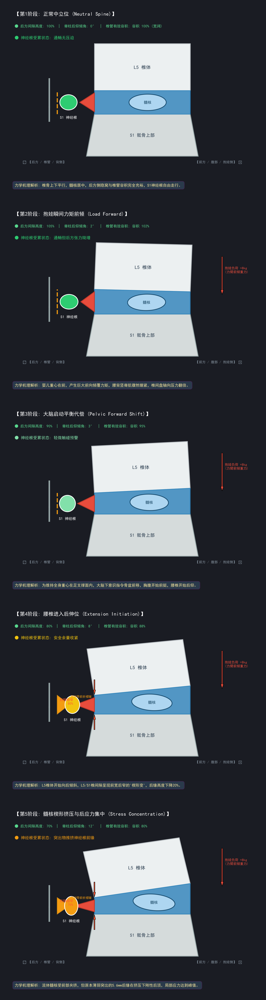
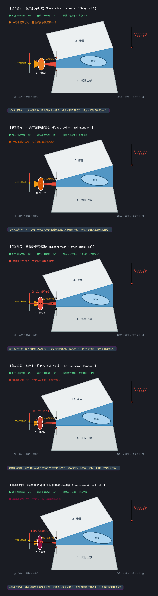

# 抱娃姿势力学分析与反弓腰 10 阶段神经绞杀演变

> **核心病理疑问**：为什么平时不痛，一带娃抱娃、特别是周天长时间抱娃后，腰部会“痛得完全直不起腰”？为什么佩戴了硬质护腰依然会不自觉地后仰反弓？

---

## 一、 宏观全身力学与“代偿反弓”的物理根源

### 1. 抱娃的杠杆力臂效应
* 6 个月大宝宝体重约 8kg，悬空抱在胸前 25cm 处。
* 根据杠杆原理：$\text{力矩} = \text{重力} \times \text{力臂}$。胸前的 8kg 负载会通过人体脊柱放大 3~4 倍，瞬间让最底层的 **L5/S1 承受 30~40kg 以上的不对称垂直压应力**。

### 2. 为什么身体会本能地“挺肚子后仰（反弓）”？
* 为了防止整个人被胸前 8kg 的重量拉得向前栽倒，大脑的前庭和运动中枢会自动启动**“骨盆前推代偿（Pelvic Swayback）”**：
  * 把骨盆和肚子拼命往前顶，让腹部充当托着宝宝的“肉板凳”；
  * 上半身被迫向后仰，把人体重心强行拉回脚后跟上方。

### 3. 为什么硬护腰“防弯腰”，却“防不住后仰”？
* **机械结构盲区**：护腰的 4 根刚性钢板安装在**后背**，腹部只有弹力布。
* 往前弯腰时，后背钢板受拉力顶死，防弯腰极佳；
* **但当人向后仰反弓时**：后背脊柱直接往后折叠，钢板跟着往后仰，前面腹部没有刚性挡板阻挡骨盆前挺。因此，即便把护腰勒得极紧，身体依然能轻易做出“后仰挺腹”动作。

---

## 二、 3D 高保真医学解剖对照：后仰时的“骨质剪刀咬合”

### 1. 正常中立位（左） vs 反弓后仰咬合（右）
| 正常中立位（健康解剖） | 抱娃极限反弓后仰（骨质夹击咬合） |
| :---: | :---: |
|  |  |
| **形态**：上下骨板平行，髓核如水润晶莹胶冻稳居中心，黄色神经根自由通畅。 | **形态**：L5 向后倾斜，上下椎骨后缘像铁钳剪刀一样闭合咬紧，纤维环被碾碎，髓核充血后爆，死死压在神经根上。 |

---

### 2. 轴位微观截面：右侧 S1 神经根的“前后夹板绞杀”

* **前方夹板**：破损膨出的 5.6mm 髓核肉团；
* **后方夹板**：反弓导致的下关节突骨撞击与向前折叠的黄韧带；
* **夹击受害者**：夹在中间的右侧 S1 神经根被挤压成扁平薄片，神经鞘膜毛细血管完全闭塞缺血，发生严重的无菌性红肿水肿（对比右侧完全正常的黄色神经根）。

---

## 三、 反弓腰 10 阶段连续生物力学演变

通过参数化生物力学模型，完整展示腰椎从 0° 中立位到 -30° 极限反弓的 10 帧连续微观物理变化：

### 阶段 1 ~ 阶段 5 汇总概览

1. **第1阶段（0° 中立位）**：椎骨平行，后方间隙 100%，椎管容积 100%，神经根自由舒展；
2. **第2阶段（抱娃前倾）**：前倾力矩增加，后背竖脊肌骤然绷紧，椎间盘轴向压力骤增；
3. **第3阶段（骨盆前移代偿）**：大脑为防摔倒，指令骨盆前送，胸腹挺起，后隙降至 90%；
4. **第4阶段（-8° 后伸初现）**：前宽后窄的“楔形变”形成，后隙降至 80%，前纵韧带绷紧；
5. **第5阶段（-12° 髓核应力集中）**：流体髓核受前部挤压，后缘破损的 5.6mm 突出点刚性后顶，推挤神经根前缘。

---

### 阶段 6 ~ 阶段 10 汇总概览（致命绞杀期）

6. **第6阶段（-18° 挺肚当托盘）**：骨盆极限前顶，后方间隙塌陷至 55%，椎弓根逼近；
7. **第7阶段（-22° 小关节撞击）**：L5 与 S1 小关节面硬碰硬撞击（承载 300% 压应力），关节囊牵拉剧痛；
8. **第8阶段（-25° 黄韧带折叠）**：椎弓高度缩短致黄韧带松弛，像手风琴般向前隆起，椎管有效容积跌破 50%；
9. **第9阶段（-28° 前后夹板绞杀）**：前方突出物 + 后方骨刺与韧带前后合围，S1 神经根压扁变形率达 74%；
10. **第10阶段（-30° 缺血放电与肌肉锁死）**：微循环彻底阻断，伤害神经元高频放电，脊髓防御反射启动，**腰肌强直抽筋成铁板——痛得彻底直不起腰！**

---

## 四、 横断面反弓受压动态视频与动图

本地播放文件已保存至：`media/video/axial_extension_dynamic.mp4`

### 动态演变观察要点：
* **00:00 启动期**：后仰角度从 0° 增至 10°，右侧隐窝间隙逐渐收紧；
* **00:01 峰值期**：后仰达到 26° 极限，突出物突入达 5.9mm，神经根被压扁变红，出现高频放电脉冲光晕，警报拉响；
* **00:02 卸载期**：大人收腹屈髋，小关节与黄韧带退回，椎管空间重新释放，神经鞘膜血供恢复。
