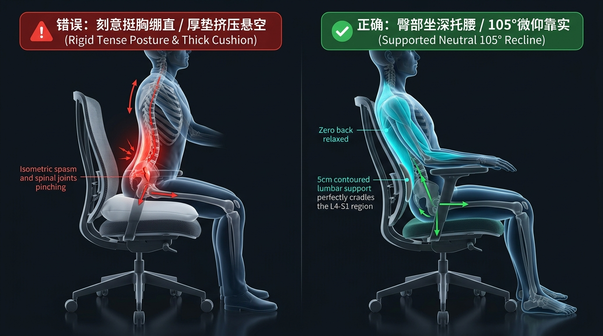
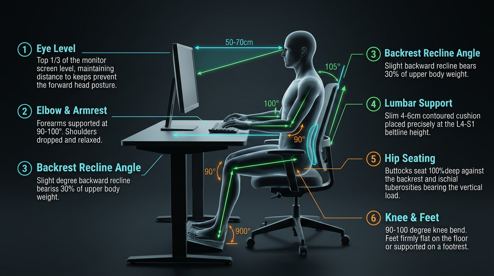

# 科学防护用药、抱娃姿势纠正与护腰避坑指南

> **核心原则**：护腰与药物是“急救消防栓”，而科学的用力习惯与工具替代才是“防火墙”。治标与治本必须结合。

---

## 一、 临床循证一线用药指南（参考方案）

针对“椎间盘突出 + 神经根水肿 + 肌肉强直绞锁直不起腰”的三联病理反应：

### 1. 药物联合方案（需遵医嘱或在药师指导下结合体质选用）

| 药物类型 | 推荐药物 | 用法与作用机制 | 针对核心痛点 |
| :--- | :--- | :--- | :--- |
| **消炎镇痛（核心灭火）** | **塞来昔布胶囊（西乐葆）** 或双氯芬酸钠缓释片 | 200mg/日，餐后服用。 抑制前列腺素合成，强效消退神经根周围的无菌性炎症与水肿。 | 消除深层神经炎性刺痛与刀割样灼痛 |
| **骨骼肌松弛剂（解决直不起腰）** | **盐酸乙哌立松片（妙纳）** | 50mg，每日 3 次，餐后服用。 阻断脊髓肌梭的反射性强直，打破“疼痛-肌肉痉挛-更严重疼痛”的死循环。 | 解除腰背肌如铁板般的强直抽筋，恢复活动度 |
| **神经营养修复** | **甲钴胺片（弥可保）** | 0.5mg，每日 3 次。 内源性辅酶 B12，促进受压神经纤维髓鞘合成与轴突再生修复。 | 针对下肢或足底的放射性麻木与酸胀 |
| **外用透皮贴剂** | **氟比洛芬凝胶贴膏（泽普思）** 或双氯芬酸二乙胺乳胶剂 | 每日 1~2 贴。 水凝胶基质，高浓度透皮吸收非甾体抗炎成分，无传统膏药刺鼻气味，对婴儿安全。 | 浅表肌筋膜炎与局部酸痛辅助镇痛 |

### 2. 为什么不推荐传统万通筋骨片作为急性期主力？
* **万通筋骨贴（外用）**：含有辣椒流浸膏，主要通过发热发辣刺激表皮血管扩张，对深入椎管内部 5~6cm 的椎间盘与神经根水肿**透皮作用极弱**，且易导致皮肤过敏。
* **万通筋骨片（口服）**：含制川乌、制草乌、马钱子粉等大辛大热中药，具有乌头碱类成分，对胃肠、心脏及肝肾有蓄积毒性风险。对于急性机械性神经卡压，西医选择性 COX-2 抑制剂抗炎靶向性与安全性显著更优。

---

## 二、 诺泰 F06 3代滑轮医用护腰佩戴与避坑要点

### 1. 为什么戴了护腰腰部依然受累？（3大使用误区排查）

* **误区 1：戴得太高，悬在细腰处**
  * **纠正**：护腰下边缘**必须下拉并卡在臀部两侧髂骨（胯骨轴）与尾椎骨上缘**！只有下摆卡死骨盆，骨盆才无法向前送，后仰动作才能被物理锁死大半。
* **误区 2：整天连续佩戴超过 2 小时**
  * **纠正**：**只在抱娃走动、搬物、站立时佩戴！** 坐下、躺下或抱娃坐着喂辅食时**立即彻底解开**。全天连戴会导致局部肌肉缺血萎缩，脱下后腰更软更痛。
* **误区 3：里面插的是“树脂软条”而非“钢板”**
  * **纠正**：诺泰出厂时可能默认插着 4 根软塑料条。**抱娃时必须替换为随盒附赠的 4 根 26° 弧形高强度金属硬钢板**！塑料条顶不住 8kg 宝宝的前倾拉力。

### 2. 闲鱼/二手选购避坑原则
* **致命暗坑**：许多闲鱼二手或退件卖家，**把最核心的“4根金属硬钢板”私吞或遗失了**，只剩塑料条。付款前必须让卖家拍照确认“4根金属钢板齐全”。
* **尺码标准**：必须以**肚脐为中心水平量一圈净腰围**，介于两码之间优先选**偏小一码**（滑轮带收紧幅度极大，买大拉到底会松垮失效）。

---

## 三、 抱娃带娃的“保腰”治本之策

### 1. 抱娃动作重构（告别骨盆前挺）
* **微屈髋、微收腹**：抱娃站立时，肚脐向内微收，屁股往后微坐一点点（屈髋 5°~10°），重心沉在脚后跟。
* **宝宝紧贴胸膛**：让宝宝的胸脯紧紧贴在大人的胸前，**严禁架在大人的肚子上方**。力臂缩短 10cm，L5/S1 承受的剪切力骤减 50%！
* **下蹲拾起**：从地垫或小床抱起宝宝时，必须**屈膝下蹲**，靠大腿股四头肌和臀大肌蹬地站起，严禁直腿弓腰拾起。

### 2. 工具升级（降维解救腰椎）
* **户外溜达 80% 场景坚决使用婴儿推车**：推车推着走，大人腰椎承受垂直重力为 0；
* **长时间抱娃使用“双肩交叉承重背带”**：选择将重量完全转移到大人**双肩、上胸椎与背部**的宽带纯背带（如 Ergobaby / BabyBjorn 结构），彻底切断腰骶部前倾力矩；
* **严禁使用单体腰凳**：单体腰凳将宝宝重力全压在下腰部，是诱发反弓后仰的重灾区。

---

## 四、 上班工位坐姿管理与椅子/腰靠避坑指南

### 1. 坐姿核心疑问破除：要不要“抬头挺胸、绷直腰背”？

> **绝对不要刻意“抬头挺胸、绷直腰背”！** 

* **为什么“军姿紧绷”是反科学的？**
  * 脊柱生理曲度依靠骨骼力学结构与韧带提供中立平衡。刻意“绷直腰背”强迫竖脊肌与多裂肌处于**高强度主动等长收缩（Isometric Spasm）**；
  * 肌内压超过毛细血管灌注压，导致背部肌肉急性缺血水肿与乳酸堆积（坐 15 分钟就腰酸背痛）；
  * 同时，过度挺腰会造成 **L5/S1 后方小关节硬碰硬撞击**，甚至诱发小关节滑膜炎；
  * 更致命的是，肌肉在 15 分钟后力竭崩溃，身体会不可抗拒地“断崖式坍塌”为极度骨盆后倾的“葛优躺”。
* **科学坐姿金标准**：**“臀部坐到底 + 4~6cm 薄腰托 + 后仰微靠 105°（依靠椅背分担 30% 重力，腰肌完全放松零张力）”**。

---

### 2. 工位错误坐姿 vs 正确中立微靠 3D 仿真对照图

* **左侧（错误：厚垫挤压 + 挺胸紧绷）**：
  * **腰垫过厚（>12cm）** 侵占了坐垫一半坐深，屁股坐不进去，只能悬在坐垫前端；
  * 腰部被强行前顶，胸椎上背部**完全碰不到后方网布靠背（上背悬空）**；
  * 竖脊肌持续痉挛（红光高亮），后方椎体小关节受压咬合，15 分钟后必塌陷滑落。
* **右侧（正确：臀部坐深 + 5cm薄托 + 105°微仰靠实）**：
  * 臀部完全塞入椅子最深处，坐骨结节垂直受力；
  * 4~6cm 弧形小腰垫精准托住 L4/L5~S1 腰骶结合部；
  * 肩胛骨和胸椎稳稳靠在 105° 倾角的网背上，**椅背直接吃掉上半身 30% 重力**；
  * 后背肌肉呈完全放松的静息状态（蓝绿光亮，零肌电张力），可舒适坐持 1~2 小时无疲劳。

---

### 3. 工位电脑桌椅 6 大几何参数校准规范图例

| 编号 | 校准部位 | 标准力学几何参数 | 核心生理目的与避坑要点 |
| :---: | :--- | :--- | :--- |
| **①** | **视线与屏幕** | **屏幕上 1/3 与双眼平齐，视距 50~70cm** | 彻底消除探颈（Forward Head Posture），阻断颈胸对下腰段的力矩牵拉 |
| **②** | **手肘与扶手** | **小臂水平屈曲 90°~100°，搭放桌面或扶手** | 避免耸肩与斜方肌紧张，卸掉上肢对肩背脊柱的向下拖拽力 |
| **③** | **靠背微仰角** | **后背倾角 100°~105°（严禁 90° 直角端坐）** | 借助靠背分担上半身 30% 重力，将椎间盘内压力降至最低 |
| **④** | **腰靠厚度与位置** | **厚度 4~6 cm 扁平薄枕，对齐裤腰带与骶骨上缘** | 严禁使用 >10cm 的大厚垫！只在 L4~S1 提供生理曲度微托，不推挤腰椎 |
| **⑤** | **臀部坐深** | **臀部坐进椅面最深处（100% 贴靠靠背底部）** | 坐骨结节均匀承重，下肢大腿获得充分支撑，彻底锁死骨盆前滑自由度 |
| **⑥** | **膝盖与足底** | **膝屈 90°~100°，双脚实打实踩在地面或脚踏板** | 严禁双脚悬空！双脚悬空会通过股骨力臂硬性拉拽骨盆后倾，诱发剧烈腰痛 |

