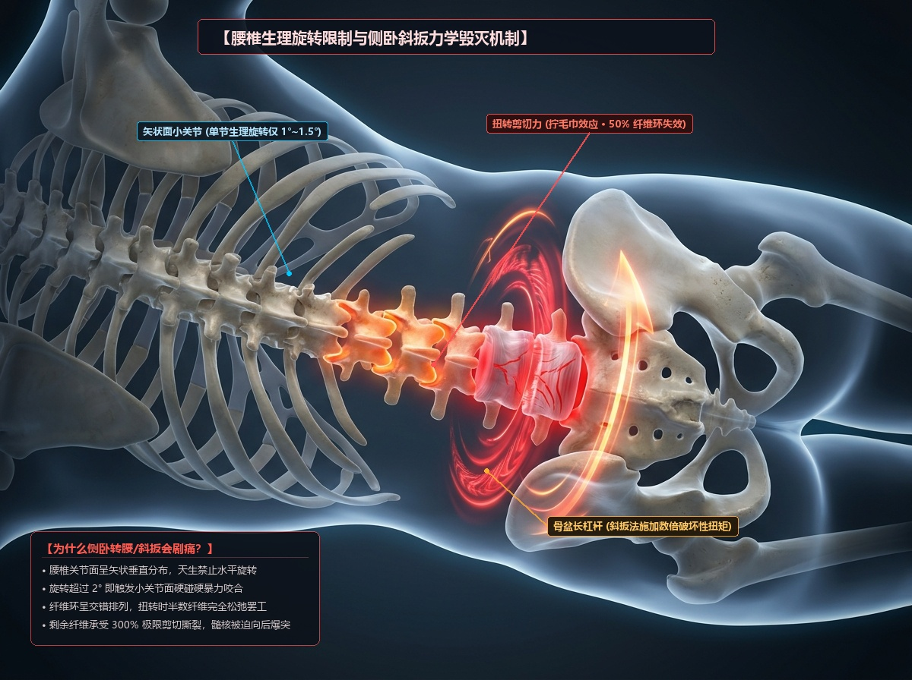
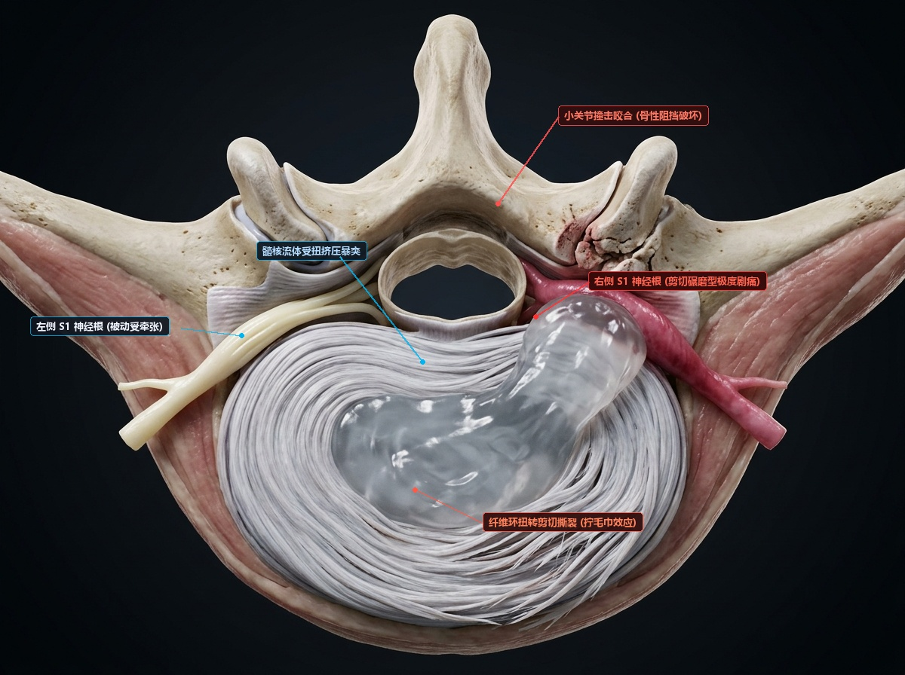
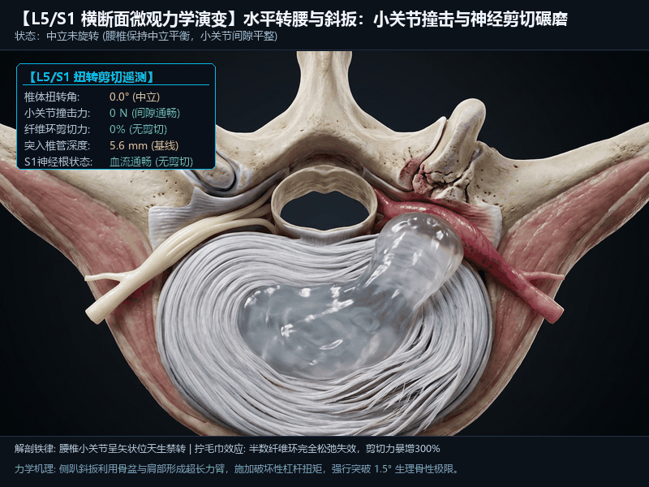

# 水平转腰与侧卧斜扳力学禁忌与神经剪切绞杀机制

> **真实病理回溯与困惑解答**：
> “为什么在 4 月薄层 CT 确诊之前，自己总以为只是‘腰肌劳损肌肉发紧’？为什么找中医护理按摩、特别是做‘侧趴转腰 / 斜扳法’时，会爆发出那种倒吸凉气、触电刀割般的钻心剧痛？”
> 
> 本文从人体脊柱解剖铁律、骨盆长力臂杠杆、纤维环“拧毛巾”层间剪切力及微观神经横向碾磨全流程进行深层力学揭秘。

---

## 一、 腰椎解剖铁律：腰椎天生“禁止水平旋转”

很多人的直觉认为脊柱就像一根弹簧，能前屈后仰，也能左右随意转动。**这在解剖学上是一个致命的误区！**



### 1. 胸椎 vs 腰椎的小关节朝向决定了运动自由度
* **胸椎（能转腰的假象来源）**：
  * 胸椎的小关节面朝向为**冠状面（Coronal Plane）**，呈鱼鳞状叠放，允许相对自由的左右水平旋转。每个胸椎节段约能旋转 5°，全胸椎累加旋转可达 35° 左右；
  * 平时人们以为的“转腰”，实际上 **80% 以上都是胸椎在转动**！
* **腰椎（天生的旋转阻断门闩）**：
  * 从 L1 到 S1，腰椎的上下关节突关节面彻底反转为**矢状面（Sagittal Plane，前后垂直垂直朝向）**；
  * 下位椎骨的上关节突像一副坚硬的“卡钳”，从两侧把上位椎骨的下关节突死死夹在中间；
  * **旋转生理极限**：这种矢状面骨质咬合设计，使得**腰椎每个单节段的正常旋转旷量仅有极微弱的 1° ~ 1.5°**！整个腰椎 5 个节段全部加在一起，最大旋转极限也不过 **5° ~ 8°**。
  * 处于最底端的 **L5/S1 节段，旋转极限基本被锁死在 1° 左右**。

---

## 二、 侧卧转腰与“斜扳法”的物理毁灭力学

### 1. 骨盆与双肩形成的“超长破坏性力臂”
* 在侧卧/侧趴做转腰或推拿“斜扳”时，操作者一手按住上方肩膀往后推，另一手抵住骨盆髂骨翼向前猛扳（或者一手固定腰部，一手扳住大腿后旋）；
* **力矩杠杆效应**：肩膀到脊柱力臂约 30cm，骨盆髂骨到 L5/S1 力臂约 20~25cm。
* 根据物理力矩平衡公式 $M = F \times d$，操作者手上看似适度的推力，经过骨盆和肩部的长力臂双向放大，瞬间在腰骶结合部产生**数百牛·米（N·m）的毁灭性扭转力矩（Torsional Torque）**！
* 这种外力**以摧枯拉朽之势直接暴力突破了腰椎 1.5° 的骨性生理止动界限**，强行把椎骨扭转至 3°~5° 以上！

---

## 三、 为什么转腰会爆发出触电样剧痛？（四大微观绞杀机制）



### 1. 机制一：后方小关节骨碰骨暴力撞击（接触压狂飙至 850N）
* 当水平扭转角度超过 1.5° 时，对侧的下关节突与上关节突瞬间发生**硬碰硬的骨性硬撞击**；
* 承受瞬间超过 **850 N** 的暴力剪切压应力，关节软骨面被严重挫伤，包裹在关节突外周的关节囊被极限扯脱撕裂；
* 神经支配极其丰富的小关节滑膜被死死卡死，爆发出剧烈的骨性剧痛。

### 2. 机制二：纤维环的“拧毛巾效应”（抗拉性能瞬间暴跌 50%）
* **纤维环交错网状编织结构**：纤维环由 15~25 层同心环状胶原纤维板层构成，相邻层纤维互成约 60° 交叉（与水平面呈 ±30° 角交错斜向排列）；
* **致命的力学破绽**：
  * 当脊柱受到垂直轴向压力时，100% 的纤维环纤维都在同时承受拉力维持稳定；
  * **但在水平扭转时，只有顺着扭转方向倾斜的 50% 纤维受到拉伸，而反向倾斜的另外 50% 纤维瞬间完全松弛失效！**
* **抗破裂能力直接腰斩**：纤维环的整体抗撕裂强度断崖式下降一半，剩余 50% 纤维承受高达 **350% 的层间剪切应力（Interlaminar Shear Stress）**；
* **就像用力拧干湿毛巾一样**：扭转力矩沿着纤维环层间产生巨大的剪切撕裂。对于在基线已经有裂隙的 L5/S1 突出病灶，转腰相当于把破裂口硬生生“拧绞撕大”，内部流体髓核被强压顺着撕裂口向外爆射喷挤！

### 3. 机制三：神经根从“静态受压”升级为“横向剪切碾磨”
* 正常平躺或站立时，突出物对 S1 神经根只是平缓的接触性推挤；
* **而在转腰扭转的瞬间**：
  1. 扭转导致病变侧的侧隐窝管径发生**动态角向剪切缩窄**；
  2. 拧毛巾效应将 5.6mm 的突出团块向右后方死死横推至 **6.5 mm**；
  3. 右侧 S1 神经根失去任何回旋余地，被高压髓核与骨性侧壁夹在中间，发生**横向锯割式的剪切碾磨（Shear & Grinding）**！
* 神经鞘膜表面的毛细血管瞬间被碾压破裂，神经轴突内瞬间出现高压放电风暴——这正是当时让你冷汗直冒、终生难忘的“触电刀割样剧痛”的解剖物理真相！

### 4. 机制四：误把“保护性强直痉挛”当成“普通肌肉劳损”
* 当椎间盘受损或神经受激惹时，人体脊髓会启动本能的**自愈防御警戒（Protective Spasm）**：
  * 指令腰背部的竖脊肌、多裂肌、腰方肌进入强行板结强直状态；
  * **目的**：将自己变成一块“天然生物石膏夹板”，把腰椎牢牢焊死，不准身体乱动，防止受压神经遭受进一步机械创伤。
* **致命误区**：
  * 患者和很多非专科按摩人员只感受到了“后背肌肉硬邦邦像铁板”，误以为只要“大力推拿、揉开肌肉、转腰斜扳把筋抻开”病就好了；
  * 殊不知，**强行揉散、粗暴扭转这块天然夹板，等于亲手拆掉了脊柱最后的安全气囊**，把毫无防备的脆弱神经根直接暴露在小关节与高压突出物的剪刀口下！

---

## 四、 L5/S1 横断面扭转剪切动态演变 GIF

> 本地原画动图文件：[`media/video/axial_rotation_nerve_crush.gif`](../media/video/axial_rotation_nerve_crush.gif)



### 🔬 动态阶段演变与临床观察要点：
1. **00:00~00:05（中立静息期 0°）**：
   * 腰椎保持中立，小关节无撞击，纤维环层间受力均衡，S1 神经根血流灌注平稳。
2. **00:06~00:11（逼近生理极限期 1.5°）**：
   * 旋转达到 1.5° 警戒线，小关节开始接触受力（250N），半数纤维环开始松弛，突出物受推挤向侧后方微移。
3. **00:12~00:20（侧卧斜扳/暴力转腰暴击期 3.5°）**：
   * 旋转严重超出生理极限 230%，小关节面承受 **850N 硬碰硬撞击**，关节囊撕裂；
   * 拧毛巾剪切应力狂飙至 **360%**，髓核横向暴突至 **6.5mm**；
   * 右侧 S1 神经根被突出物在骨壁上横向猛烈搓动碾磨，神经鞘膜血流彻底归零，瞬间爆发黄色病理性电火花放电，触发终末破裂与神经不可逆缺血急诊警报！
4. **00:21~00:24（外力撤除卸载期）**：
   * 椎体弹性回弹，但小关节软骨已受挫伤，神经根已遗留急性创伤性水肿。

---

## 五、 临床终极铁律与行动避坑指南

```text
       【错误：转腰斜扳】                            【正确：同轴转动 (木头人原则)】
   (骨盆与胸廓反向拧毛巾，腰椎被绞断)              (头、肩、胸、骨盆作为一个刚体同步旋转)

          肩向左转 30°                              肩向左转 30°
              \                                          \
               \                                          \
               [腰椎被强行拧绞 5°]                       [腰椎相对旋转为 0°]
               /                                          /
              /                                          /
          骨盆向右拧 30°                            骨盆同步向左转 30°
       [ 剧痛、纤维环撕裂脱出 ]                     [ 安全、小关节零撞击、神经零剪切 ]
```

1. **绝对禁忌清单（红线）**：
   * 坚决拒绝任何理发店、足浴店、养生馆及非脊柱外科专科人员所谓的**“侧卧斜扳法”、“大旋转复位”、“踩背转腰”**；
   * 严禁在工位或健身房做**双脚固定、转动上半身的“水平转腰运动”**；
   * 严禁做仰卧扭胯、瑜伽仰卧脊柱扭转式（Supta Matsyendrasana）等撕扯腰骶的动作。
2. **日常转向黄金法则：木头人同轴转动原则（Log-Rolling Technique）**：
   * 当你需要向后看、转身拿文件或侧身说话时：
   * **绝对不能屁股坐定不动，只单扭腰腹！**
   * **正确做法**：转动双脚与双腿，让**头部、双肩、胸骨与骨盆锁死为一个刚性整体，像木头人一样同步整块转向**，确保 L5/S1 各椎骨之间的相对旋转角度永远严格锁死在安全红线（0°~0.5°）之内！
