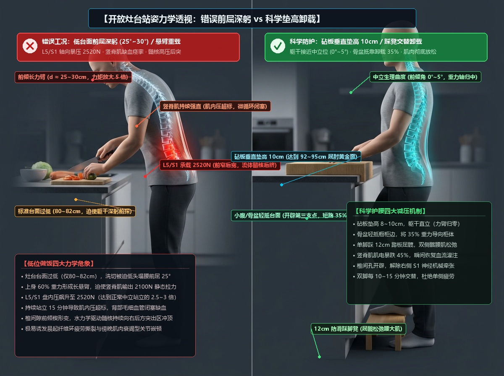
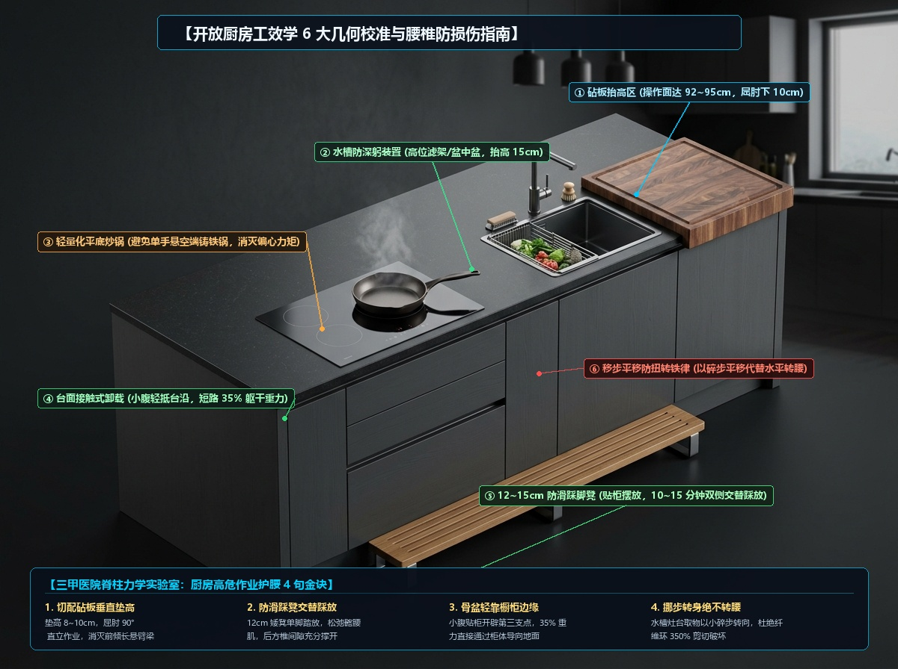
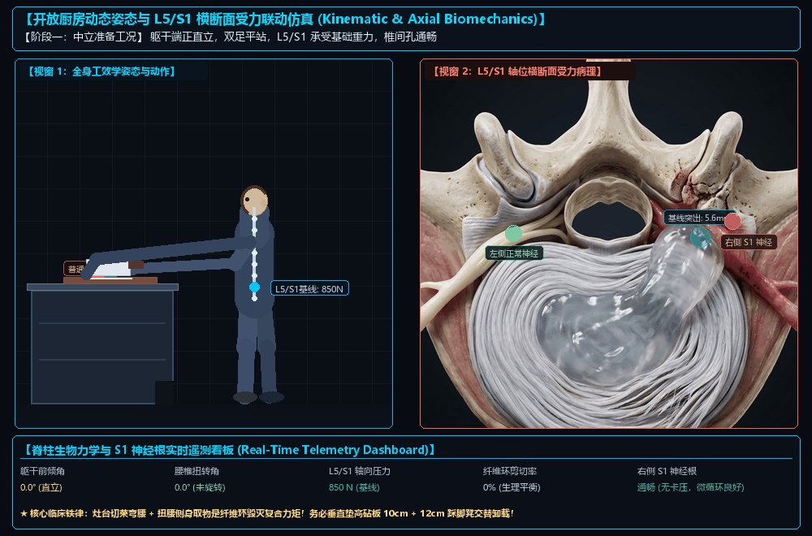

# 开放灶台区生物力学分析与人体工学防护指南

> **真实日常场景回溯与临床困惑**：
> “每天早晚各在开放灶台区忙碌 1 小时做饭洗切，为什么做完饭后腰部会像灌了铅一样硬邦邦、直不起腰？为什么有时稍微侧身拿个调料或端起锅，右侧臀部或大腿后侧就会窜过一阵酸胀麻痛？”
> 
> 本文针对家庭厨房烹饪作业，从人体脊柱生物力学杠杆、肌肉等长收缩缺血、纤维环“前窄后宽”水锤挤压、昼夜水合节律以及踩脚凳减压工程进行全流程深度量化解析。

---

## 一、 宏观生物力学建模：灶台前屈的“杠杆放大效应”

许多人误以为“站着做饭也是站立，比坐着健康”。**这在脊柱生物力学上是一个致命的直觉盲区！**



### 1. 灶台前倾长悬臂梁模型（Cantilever Beam）
* **几何失配**：国内住宅标准橱柜台面高度通常为 **80 ~ 82 cm**（水槽底更是低至 **60 ~ 65 cm**），而我国成年人立位屈肘操作高度普遍在 **105 ~ 115 cm**；
* 为了双手能够触及台面切菜、洗菜、炒菜，人体躯干被迫陷入**持续 20° ~ 30° 前屈深躬**；
* **力臂放大**：人体上半身（头、颈、上肢、胸廓）约占体重的 **60%**（按 70kg 体重计算，上身重力约为 $420\,\text{N}$）。前屈 25° 使得上半身重心向前伸出约 **$25 \sim 30\,\text{cm}$** 的长力臂（$d$）；
* 腰背竖脊肌附着点到腰椎旋转中心（L5/S1 支点）的有效内力臂（$r$）仅约 **$5\,\text{cm}$**。

### 2. L5/S1 轴向暴压的数学量化推导
根据经典力矩平衡方程 $\sum M = 0$：
$$F_{\text{竖脊肌}} \times r = F_{\text{上身}} \times d$$
$$F_{\text{竖脊肌}} = \frac{420\,\text{N} \times 25\,\text{cm}}{5\,\text{cm}} = 2100\,\text{N}$$

L5/S1 承受的垂直轴向总压缩载荷（Compression Load）：
$$F_{\text{总压力}} = F_{\text{上身}} + F_{\text{竖脊肌}} \approx 420\,\text{N} + 2100\,\text{N} = 2520\,\text{N}$$

* **量化对照（Nachemson 盘内压标准）**：
  * 中立端正站立：L5/S1 轴向负荷约 **$700 \sim 1000\,\text{N}$**；
  * **灶台前倾 25° 站立：轴向暴压飙升至 $2520\,\text{N}$（相当于 250 公斤重压死死焊在 L5/S1 椎间盘上）**；
  * 若切菜剁骨下压或单手端起铸铁炒锅（力臂延伸至 45cm），局部载荷瞬间突破 **$3200\,\text{N}$**。

---

## 二、 晨晚双重夹击：昼夜生物力学脆弱窗口

每天“早 1 小时 + 晚 1 小时”的节律，恰好精准踩中了人体椎间盘在一天中最脆弱的两个生理极限点：

### 1. 晨起 1 小时：“高水合膨胀脆性窗口”
* **夜间渗透吸水**：平卧睡眠 8 小时期间，椎间盘卸去轴向负荷，通过渗透压充分吸水，髓核体积与盘高增加约 10%~15%，盘内流体静压达 24 小时峰值；
* **抗形变刚度过高**：晨起前 1~2 小时内，纤维环处于高张力饱满绷紧状态（Turgid & Stiff）。此时进行持续前屈，纤维环后外侧承受的外周环向应力（Hoop Stress）比傍晚**高出整整 300%**！
* **临床后果**：在清晨刚起床、脊柱尚未活动开时立即进入厨房前屈深躬 1 小时，极易直接诱发纤维环既有撕裂口的锐性扩大！

### 2. 傍晚 1 小时：“肌电衰竭与被动结构过载窗口”
* **盘内水分流失**：经过白天全天站立、坐姿与走动，椎间盘发生黏弹性脱水蠕变（Creep），高度降低，水力缓冲减震储备下降 20%~30%；
* **核心肌群力竭**：竖脊肌、多裂肌在伏案一天后已堆积大量乳酸。傍晚再站立做饭 1 小时，主动肌肉保护屏障彻底失活；
* **负荷硬着陆**：全部前屈拉力硬生生转移至后方的棘上韧带、棘间韧带、黄韧带及纤维环后缘。做完晚饭后的“腰酸背僵、直不起腰”，正是**竖脊肌重度缺血痉挛与椎间韧带被动蠕变撕扯**的临床表现。

---

## 三、 开放厨房微观破坏机制：前屈叠加水平微转



### 1. 椎间隙“前窄后宽”，髓核向右后方突出区冲顶
* 躯干前屈使上终板向前倾斜，L5/S1 椎间隙前方高度受压塌陷，后方张开；
* 髓核作为富含蛋白聚糖的半流体胶状物，受前侧挤压产生水动力学后移推力；
* **结合 L5/S1 局限型中央偏右（5.6mm）基线**：髓核持续冲撞撕裂薄弱的右后方纤维环，推挤右侧侧隐窝前壁与右侧 S1 神经根。

### 2. 水平微转腰：纤维环的“拧毛巾”剪切绞杀
* 在开放式厨房做饭，频繁在水槽洗菜、中台切配、右侧灶台翻炒以及侧后方取调料之间来回切换；
* **腰椎解剖铁律**：腰椎关节突关节面呈矢状垂直咬合，**单节段正常生理旋转极限仅 1° ~ 1.5°**；
* 当在前屈 25° 状态下以双脚为轴心强行扭转躯干：
  * 纤维环由交叉排列的胶原束组成，扭转时顺向 50% 纤维拉紧，反向 50% 纤维瞬间完全松弛；
  * **抗撕裂性能瞬间腰斩**，剩余纤维承受高达 **350% 的层间剪切应力**；
  * 突出团块被横向推挤，犹如锉刀横向挫擦右侧 S1 神经鞘膜，诱发剧烈放电。

---

## 四、 厨房动态力学演变仿真（动态 GIF 指导）



### 动态全流程四阶段演进特征：
1. **阶段一（0~12帧）：中立站姿基线**：躯干前倾角 0°，L5/S1 承载 850N，竖脊肌血流通畅，突出物维持在 5.6mm 基线，右侧 S1 神经根周围空间通畅；
2. **阶段二（13~28帧）：低台面前倾切配**：躯干前屈逐渐加深至 25°，盘内压飙升至 2520N，椎间隙楔形变，髓核流体向右后方膨出达 6.4mm，右侧 S1 神经根受压变形率升至 68%；
3. **阶段三（29~42帧）：持续 30 分钟等长痉挛**：肌内压超过毛细血管灌注压（>40mmHg），肌肉完全缺血强直，神经根微循环受阻爆发高频黄色电风暴；
4. **阶段四（43~60帧）：踩脚凳+垫高砧板介入**：单脚踏入 12cm 矮凳屈髋，躯干恢复中立微直立，骨盆靠台卸载，盘内压瞬间骤降至 1120N，突出物回缩平复，S1 神经根供血完全恢复。

---

## 五、 彻底阻断伤害：厨房人体工学 4 大黄金铁律

```
               【厨房高危作业护腰 4 句金诀】
  ┌───────────────────────┬───────────────────────┐
  │ 1. 切配砧板垂直垫高   │ 2. 防滑踩凳交替踩放   │
  │    垫高 8~10cm 直立作业 │    12cm 踏板松弛髂腰肌│
  ├───────────────────────┼───────────────────────┤
  │ 3. 骨盆轻靠橱柜边缘   │ 4. 挪步转身绝不转腰   │
  │    小腹贴柜短路 35% 载荷│    碎步平移保护纤维环 │
  └───────────────────────┴───────────────────────┘
```

### 1. 砧板垂直垫高 8~10 cm（消灭长悬臂梁）
* **高度几何基线**：操作者站立、双肩自然下沉、双肘弯曲 90° 时，**掌心平面下方 10 ~ 15 cm 为最佳切割高度（通常为 92 ~ 95 cm）**；
* **实施方案**：购入厚度 5~8cm 的加厚端纹重型实木砧板（如北美黑胡桃/相思木拼板，自重 4kg 以上带前包唇防滑动款），或在现有砧板下加装专用不锈钢防滑增高架；
* **效果**：操作时上身完全恢复 0°~5° 直立，前倾力臂 $d$ 缩短 80%，盘内压瞬间直降 $1400\,\text{N}$。

### 2. 配备 12~15 cm 防滑踩脚凳（松弛腰大肌）
* **力学机制**：将单脚抬高踏在 12cm 矮凳上，使同侧髋关节屈曲 20°~30°：
  * **松弛髂腰肌与腰大肌**：解除对腰椎前方的向下拉扯；
  * **诱导骨盆适度微后倾**：生理性展平腰椎前凸，后方椎间孔与侧隐窝空间微度开辟，解除对受压右侧 S1 神经根的紧绷张力；
  * **卸载竖脊肌**：背伸肌群肌电活动（EMG）骤降 45%，毛细血管灌注压瞬间恢复。
* **临床交互规范**：**每 10~15 分钟双侧交替踩放一次**，严禁单腿持续踩死引起假性骨盆歪斜。

### 3. 小腹/骨盆轻抵橱柜边缘（开辟第三支点）
* 站立操作时，双足前掌自然深入橱柜踢脚线凹槽内；
* 将耻骨联合上缘/小腹下缘轻轻抵靠在橱柜台面外沿；
* **卸载机制**：利用刚性橱柜作为支撑点，将上半身 **30%~35% 的重力力流直接通过骨盆导向柜体与地面**，不再经过 L5/S1 悬空简支梁。

### 4. 挪步转身绝不转腰（保护纤维环）
* 在水槽、砧板、炉灶之间移动取物时，**严禁以双脚为固定轴心、仅扭转上半身**；
* **规范动作**：双脚以小碎步快速平移、正面向目标工位。将角度旋转完全交给下肢与髋关节消化，腰椎始终锁定在安全中立位。

---

## 六、 厨房护腰装备落地看板与选型清单

| 装备类别 | 关键推荐规格 | 核心防损指标 | 避坑警告 |
| :--- | :--- | :--- | :--- |
| **防滑踩脚凳** | 高度严格在 **$10 \sim 15\,\text{cm}$**；踏面 $\ge 35\times 22\,\text{cm}$；实木或一体加厚 PP | 底部必须有全包围橡胶防滑条；承重 $\ge 150\,\text{kg}$；四角外展防侧翻 | ⚠️ 严禁买折叠塑料马桶凳（边缘受力易垮塌）；严禁买高度 $>18\,\text{cm}$ 的高凳 |
| **加厚切配砧板** | 厚度 **$5 \sim 8\,\text{cm}$**；端纹拼接实木（重型带挡水槽）；带台面防滑包边边唇 | 操作高度垫高至 $92\sim 95\,\text{cm}$，使切菜肘关节保持 90°~100° | ⚠️ 避免轻飘塑料薄砧板（频繁滑动移位导致躯干发力不均） |
| **水槽抬高滤篮** | 304 不锈钢挂架式“盆中盆”或伸缩高位洗菜篮 | 将洗菜平面从槽底 60cm 提升至 **$75 \sim 80\,\text{cm}$** | ⚠️ 严禁整个人俯身深潜入深水槽底部长时间刷锅洗碗 |
| **轻量化炊具** | 铝合金/钛复合轻量化炒锅（单锅重 $\le 1.2\,\text{kg}$） | 减少单手端锅翻炒时的前倾悬臂偏心破坏扭矩 | ⚠️ 严禁腰突急性期/疲劳期单手端起 $>3\,\text{kg}$ 的纯生铁/铸铁重锅 |
| **外固定护腰** | 滑轮增压支撑款（如诺泰 F06 类） | 在早晚高危做饭 1 小时窗口期内佩戴，提供 25% 额外刚性支撑 | ⚠️ 仅在做饭特定高危劳动期间佩戴，离开厨房后及时取下，避免肌肉依赖 |
